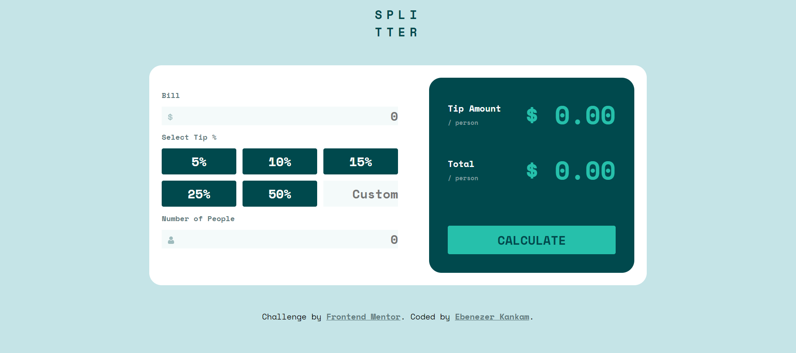

# Frontend Mentor - Tip calculator app solution

# Overview

A reactjs and sass tip calculator. This apllication allows the user to calculate the tip and total and split equally among the parties involve.

## The challenge

Users should be able to:

-   View the optimal layout for the app depending on their device's screen size
-   See hover states for all interactive elements on the page
-   Calculate the correct tip and total cost of the bill per person

## Installation

You can clone the repo to your local machine and run `npm start` to get the application running.

## Stack

-   React js
-   Sass
